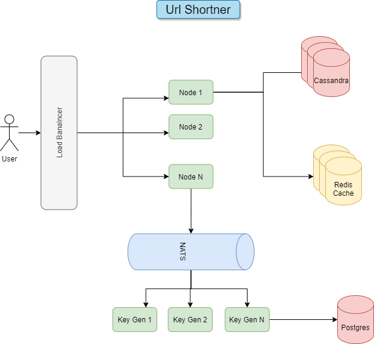

# Url Shortner
This is a design & implementation for a large scale url shortner. 
The aim of making this is to learn and implement a scalable url shortner. 

## Requirements
1. Given a long URL, the service should generate a shorter and unique alias of it.
2. Shortened link should be as small as possible
3. When the user hits a short link, the service should redirect to the original link.
4. The system should be highly available. This is really important to consider because if the service goes down, all the URL redirection will start failing.
5. URL redirection should happen in real-time with minimal latency.
6. Once a shortened link is generated it should stay in system for lifetime

## Optional Requirements
1. Shortened links should not be predictable.
2. Analytics of URLs
3. Deployment with Kubernetes
4. Github CI/CD Pipeline 

## Scale
- 100M new URL shortenings per month
- We keep every URL for 10 Years
- 200:1 read/write ratio

### Estimates based on the scale
- Writes per second - 100 million / (30days*24hours*3600seconds) = 40Urls/Second
- Read per second - 40*200 = 8000 URLs/s
- Total storage needed - 100 million/month * 10 years * 12 months * 1kb data/url = 12TB

## System design approach 

### Explaination
1. Will use cassandra for storing high volume of short urls. We could have used MongoDB with shards as well. 
2. For short key generation we are having a different service. The reasoning for that is explined in the article.
3. We use NATs as our pub/sub for inter service communication. 
4. Redis is used for caching. We'll be using redis sentinel with read replicas to increase read performance & High availability. 

## API

## Services
- Shortner for serving short urls and creating new short url. 
- Keygen - Service for generating a shortkey for a url.

### Help resources
https://github.com/xmlking/micro-starter-kit